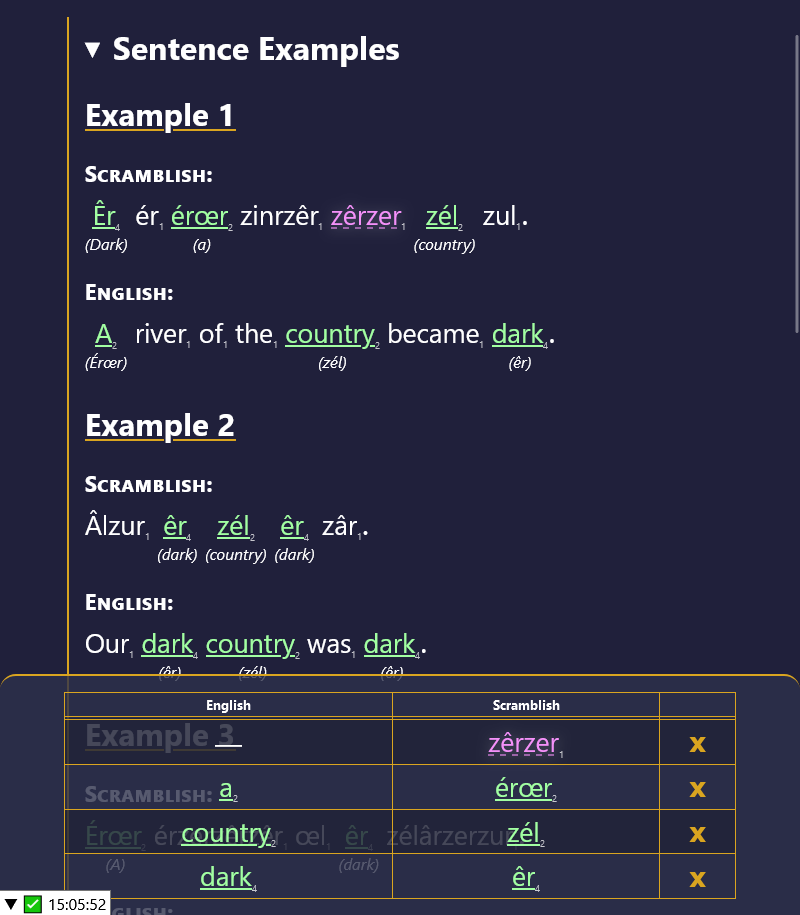

# Scramblish
A game about translating randomly generated languages.



# ⇒ [Play Online](https://eignnx.github.io/scramblish-elm) ⇐
Click the link above to play the game.

# Development Environment

You need `npm` and `elm` installed.

To have elm recompile on edit:

```shell
$ npm run dev
```

Then run a static file server such as with

```shell
$ npx http-server /path/to/project -o -p 9999
```

Then navigate to [localhost:9999](localhost:9999).